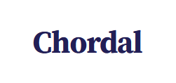
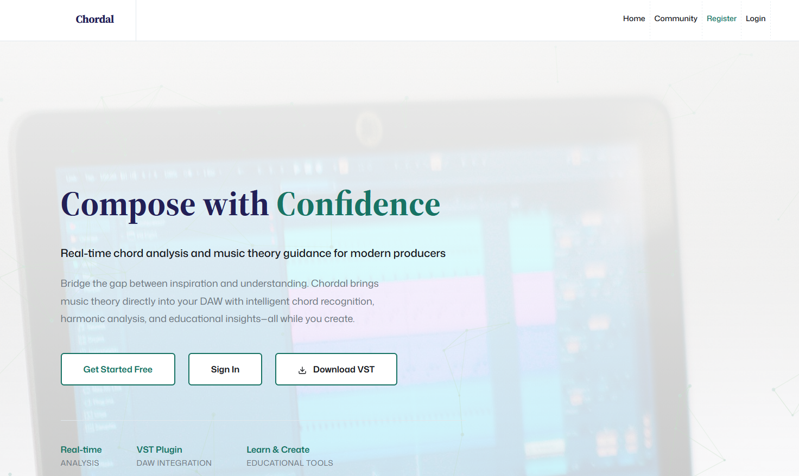
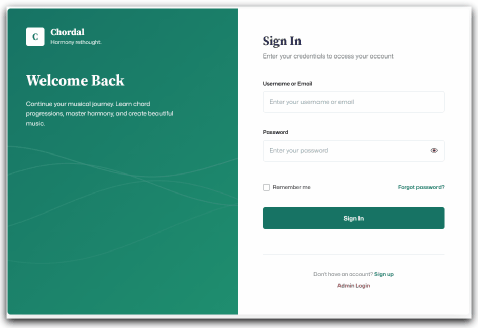

# Chordal Web Platform




**Chordal Web Platform** is an educational web application designed to help musicians learn music theory through chord progression analysis. This platform integrates with the [Chordal VST Plugin](https://github.com/tempOcha/Chordal-Plugin-Public-Ver) to provide a comprehensive music theory learning experience.

> **Note:** This repository is archived as a reference for a final year project completed in 2025. It is not actively maintained and contributions are not accepted.

##  About



Chordal is a two-component system designed to bridge the gap between Digital Audio Workstation (DAW) composition and music theory education:

1. **[VST Plugin](https://github.com/tempOcha/Chordal-Plugin-Public-Ver)**: A real-time chord detection and analysis tool built with JUCE/C++
2. **Web Platform** (this repository): An ASP.NET-based educational platform for chord progression management and theory learning

The web platform allows users to:
- Upload and manage chord progressions exported from the VST plugin
- Learn music theory through interactive lessons
- Share progressions with the community with a custom made MIDI-roll display!
- Track their learning progress
- Explore chord progressions created by other users

This project was developed as a final year project to demonstrate the integration of desktop plugin development with web-based educational tools.

---

## Features

### User Management



- User registration and authentication with secure password hashing (PBKDF2)
- Profile management and customization
- Password reset functionality with email notifications
- User preferences for notifications and privacy

### Progression Management


- Upload chord progressions (JSON format from VST plugin)
- View and edit progression metadata (title, key, tempo, category)
- Download progressions as JSON or MIDI files
- Share progressions with the community or keep them private

### Learning Center


- Interactive music theory lessons
- Progression of lessons from basic triads to advanced concepts
- Theory explanations with Roman numeral notation
- Visual chord analysis tools

### Community Features


- Browse public chord progressions
- Like and comment on progressions
- Rate progressions (star rating system)
- Tag-based search and filtering
- Report inappropriate content
- Load downloaded MIDI into your favoured DAW!

### Admin Panel


- User management (enable/disable accounts)
- Content moderation (review reported content)
- Community guidelines management (CMS)
- Analytics dashboard
- Two-factor authentication for admin access

---

##  System Architecture

```
┌─────────────┐         ┌──────────────┐
│ VST Plugin  │         │ Web Platform │
│ (C++/JUCE)  │         │(HTML/CSS/C#) │
└──────┬──────┘         └──────┬───────┘
       │                       │
       │─── Token-based Login──┤
       │                       │
       │  JSON Export          │
       └────────┬──────────────┘
                │
          ┌─────▼─────┐
          │JSON Files │
          └─────┬─────┘
                │
          Manual Upload
                │
          ┌─────▼─────┐
          │JSON Parser│
          └─────┬─────┘
                │
          ┌─────▼──────┐
          │   MSSQL    │
          │  Database  │
          └────────────┘
```

The system uses a file-based integration approach rather than real-time synchronization:
1. Users compose in their DAW with the VST plugin analyzing chords
2. VST exports progressions as JSON files
3. Users manually upload JSON files to the web platform
4. Backend parses JSON and stores data in MySQL database
5. Users can download progressions back as MIDI through a custom JSON -> MIDI Parser

---

## Technology Stack

### Backend
- **ASP.NET Web Forms** (C#)
- **MSSQL** for database management
- **ADO.NET** for database operations
- **System.Data.SqlClient** for SQL Server connectivity

### Frontend
- **HTML5** for structure
- **CSS** for styling (custom design system)
- **JavaScript** for interactivity and animations
  - **p5.js** for custom animations/graphic drawing
  - **animeJS** for component animations
  - **Chart.js** for charts
- **Bootstrap** components (selectively used)

### Security
- **PBKDF2** password hashing (100,000 iterations)
- **JWT tokens** for VST plugin authentication
- **SQL parameterized queries** to prevent injection
- **Input validation** and sanitization

### External Services
- **SMTP** for email notifications (password reset, admin 2FA) (however, only locally implemented ie appears in Console)

---

##  Database Schema

See `CurrentChordalDatabaseTablesAndProcedures.txt` for complete schema.

---

## Setup Instructions

### Prerequisites
- Windows Server or IIS 10+
- .NET Framework 4.7.2 or higher
- Visual Studio 2022+ (for development) (Can Install .Net Framework directly inside )

### Installation Steps

1. **Clone the repository**
   ```bash
   git clone https://github.com/tempOcha/chordal-web-platform.git
   cd chordal-web-platform
   ```

2. **Database Setup**
   ```sql
   -- Create database
   CREATE DATABASE ChordalDB;
   
   -- Run the schema script
   -- Execute CurrentChordalDatabaseTablesAndProcedures.txt
   ```

3. **Configure Connection String**
   
   Create a `Web.config` file based on `Web.config.example`:
   ```xml
   <connectionStrings>
     <add name="ConnectionString" 
          connectionString="Server=localhost;Database=ChordalDB;User Id=your_user;Password=your_password;" 
          providerName="System.Data.SqlClient" />
   </connectionStrings>
   ```

4. **Email Configuration** (Optional - for password reset & 2FA)
   
   Add to `Web.config`:
   ```xml
   <appSettings>
     <add key="SmtpHost" value="smtp.gmail.com" />
     <add key="SmtpPort" value="587" />
     <add key="SmtpUsername" value="your-email@gmail.com" />
     <add key="SmtpPassword" value="your-app-password" />
     <add key="SmtpEnableSSL" value="true" />
   </appSettings>
   ```

5. **Build and Run**
   ```bash
   # Open in Visual Studio
   # Restore NuGet packages
   # Build solution (Ctrl+Shift+B)
   # Run (F5)
   ```

6. **Create Admin Account**
   
   Register a user, then manually update the database:
   ```sql
   UPDATE Users SET IsAdmin = 1 WHERE Email = 'your-admin@email.com';
   ```

---

## Integration with VST Plugin

The Chordal Web Platform is designed to work seamlessly with the [Chordal VST Plugin](https://github.com/tempOcha/Chordal-Plugin-Public-Ver).

### Workflow

1. **Compose in DAW**: Create chord progressions in your DAW with the VST analyzing in real-time
2. **Export JSON**: Use the VST's export feature to save progression as JSON
3. **Upload to Web**: Log into the web platform and upload the JSON file
4. **Analyze & Share**: View theory analysis, share with community, or use for learning

### JSON Format

The VST exports progressions in this format:
```json
{
  "progressionTitle": "Recorded Progression",
  "keyRoot": 0,
  "isKeyMajor": true,
  "timestamp": "2025-10-24T10:30:00Z",
  "chordalVersion": "1.0.0",
  "chordEvents": [
    {
      "startTime": 0.0,
      "duration": 2.5,
      "chordInfo": {
        "name": "C",
        "notes": [60, 64, 67],
        "rootNote": 0,
        "quality": "", 
        "romanNumeral": "I",
        "function": "Tonic"
      }
    }
  ]
}
```

### Token-Based Login

The VST can open a browser with an authentication token:
```
https://site.com/TokenLogin.aspx?token=ENCRYPTED_TOKEN
```


---

## Project Structure

```
chordal-web-platform/
├── *.aspx                    # Web Forms pages
├── *_aspx.cs                 # Code-behind files
├── *.Master                  # Master pages
├── *.css                     # Stylesheets
├── *.js                      # JavaScript files
├── /App_Code/                # Helper classes
│   ├── PBKDF2Hash.cs        # Password hashing
│   ├── NotificationHelper.cs # Email notifications
│   ├── MidiExportHelper.cs  # MIDI file generation
│   └── LearningCentreHelper.cs
├── /Uploads/                 # User uploaded JSON files
├── Web.config               # Configuration (not in repo)
├── Web.config.example       # Configuration template
└── CurrentChordalDatabaseTablesAndProcedures.txt
```

### Key Files

- **LandingPage.aspx**: Home page with features overview
- **Login.aspx/Register.aspx**: Authentication pages
- **UploadProgression.aspx**: JSON file upload interface
- **MyProgress.aspx**: User's progression library
- **LearningCentre.aspx**: Educational lessons
- **CommunityBrowse.aspx**: Browse public progressions
- **AdminDashboard.aspx**: Admin control panel

etc...

---

## License

This project is provided as-is for reference purposes only. This is a final year academic project and is **not licensed for commercial use or redistribution**.

If you wish to use any part of this code for your own projects, please contact the author. 

---

## Author(s)

**M. A. Aiman (aka tempOcha) and M. L. Joaqhim**

---

##  Acknowledgments

This project was completed as a final year project in 2025. Special thanks to:

- **University supervisors** for guidance and feedback
- **JUCE Framework** for enabling VST development
- **Music theory resources** including Hooktheory and academic papers on tonal function
- **Test users** who provided valuable feedback during development

---

##  Related Projects

- [Chordal VST Plugin](https://github.com/tempOcha/Chordal-Plugin-Public-Ver) - The companion VST3 plugin for real-time chord analysis

---

## Contact

For questions or inquiries about this project, please open an issue on GitHub.

**Project Status**: Archived - Reference Only - No Active Development

---
